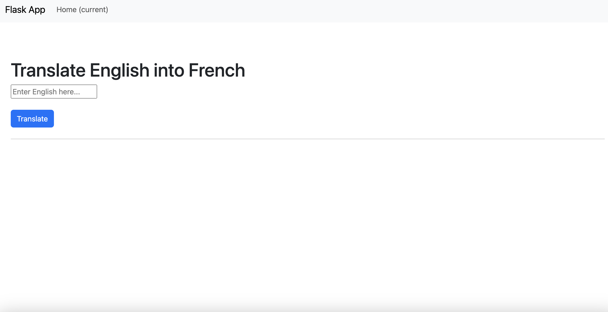
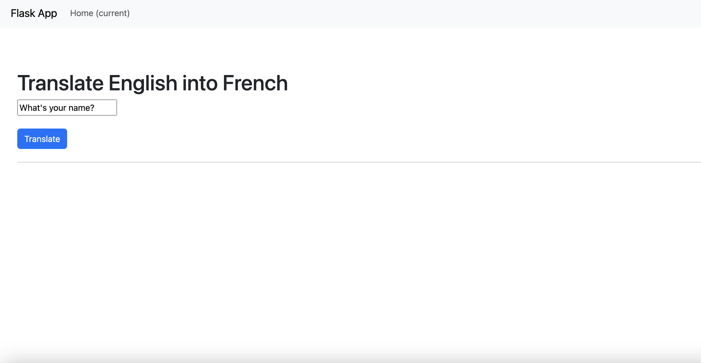
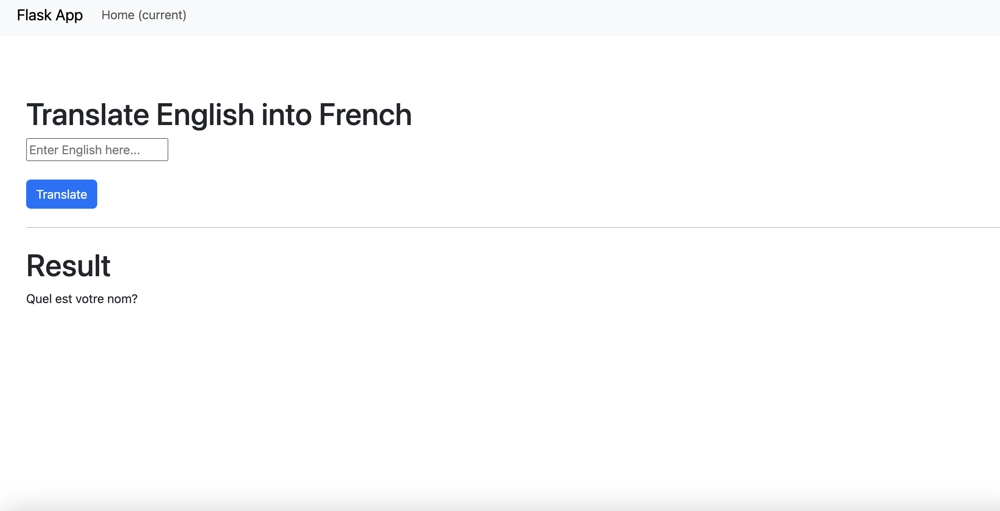
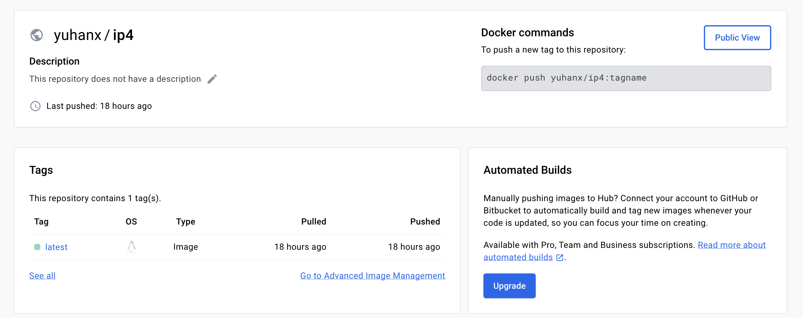
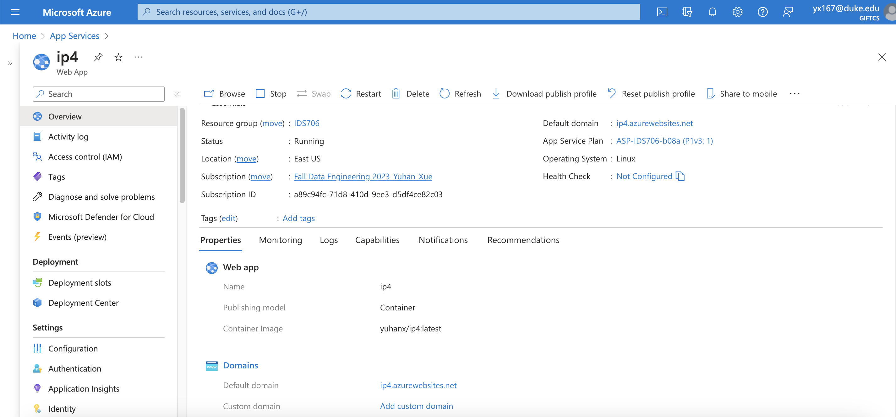

# IDS706-Flask-YuhanXue

This individual project 4 is a Flask web app which can translate Engilsh into French.
Here is the link of the web app: [https://ip4.azurewebsites.net/](https://ip4.azurewebsites.net/)

## Flask App Explanation
In this app, I utilized a translation pipeline (BART LLM) from Hugging Face, which can translate from one language to another. In this web app, texts can be translated from English to French.
The main page of the web app is as follows:

You can enter the English you want to translate into French.

Click the `Translate` button, the result will show as follows:

## Use of DockerHub
I setup an image on DockerHub as the picture showing below:

### Docker Setup
Login to DockerHub using the command `docker login --username <username>`  
Setup a Docker container image: `docker docker build -t <username>/<repo> .` 
Push the image to DockerHub: `docker push <username>/<repo>`

## Azure Web App Deloyment
The web app is deployed on Azure. I created a web app on Azure and chose "Container" regrading publishing model. My web app deployment shows in the below screenshot:

### Demo Video Link
Project walkthrough: [https://youtu.be/7IbmLja_ciE](https://youtu.be/7IbmLja_ciE)